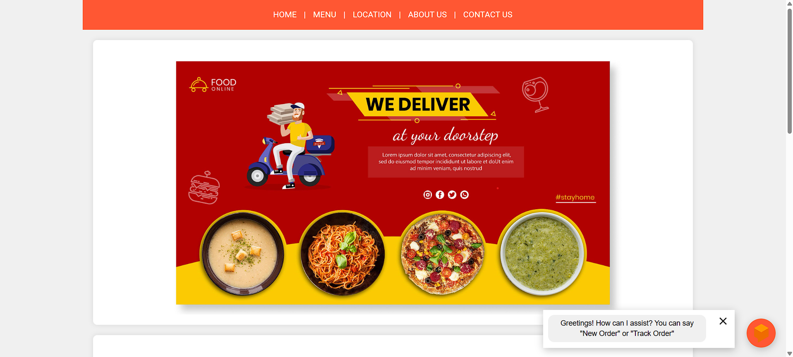

# End-to-End-NLP-Project | Chatbot-using-Dialogflow
## This project is creating a chatbot using the Dialogflow platform.

## Tools Required:
```
          HTML and CSS (Web page implementation)
          MySQL Workbench
          mysql-connector-python
          fastapi[all] (Backend)
          Dialog Flow
          ngrok (to create a secure connection)
```

## Introduction:
### The primary objective of this project is to develop a chatbot for "Food Restaurants" an online food delivery company. In this context, the chatbot assists customers in placing orders and tracking their delivery.

### Core Functions:
```
          Natural Language Understanding
          Seamless Order Placement and Tracking
          Intuitive Menu Exploration
          Convenient Order History and Reordering
          Automatic Calculation of the Total Amount
```

# Technologies and Tools:
## 1) Dialogflow :
```
    Dialogflow is a natural language processing platform, crafted by Google.
    Its purpose lies in the facilitation of intelligent and interactive conversational interfaces.
```
### Intents :
```
Intents serve the crucial role of deciphering the user's intentions or requests within a conversational interface.
The following are specific intents within this context:

        - Default Welcome Intent
        - Default Fallback Intent
        - new.order
        - order.add - context: ongoing order
        - order.remove - context: ongoing order
        - order.complete - context: ongoing order
        - track.order
        - track.order - context: ongoing-tracking
```
### Entities :
```
 Entities play a pivotal role in extracting precise information from user input.
 Here are the identified entities in this context:

        - food-item
        - number (representing food quantity)
```
### Contexts :
```
 In Dialogflow, contexts play a vital role in sustaining the conversation's continuity across multiple interactions.
 The relevant contexts for this scenario include:

        - ongoing order
        - ongoing tracking
```
### Fulfillment :
```
 The capabilities of the Dialogflow chatbot can be extended using the fulfillment option by integrating it with external services
 and APIs. For that, the webhook mechanism is used. That allows Dialogflow to send a request to a designated URL, whenever a
 specific intent is matched. This URL should be in HTTPS format to make a secure connection. 
```
### Webhook :
```
 Dialogflow facilitates the integration of external APIs via webhooks, empowering chatbots to retrieve real-time information
 and execute actions beyond their inherent capabilities.
 For the specified intents, the webhook option has been activated:

        - new.order
        - order.add - context: ongoing order
        - order.remove - context: ongoing order
        - order.complete - context: ongoing order
        - track.order - context: ongoing-tracking
```
### Integration :
```
 Dialogflow can be integrated with various platforms, including websites. messaging apps, and voice platforms.
 In this project, I integrated it with the website.
```
## 2) Backend :
```
 I implemented the backend code using the Python FastAPI in PyCharm. 
 I implemented it in three files.  

     - Main             ==>  Handle the request and extract the required details from the payload(Response of the Chatbot). 
                             functions for different intents(add, remove, complete, track order).
                             
                             libraries:  from fastapi import Request
                                         from fastapi.responses import JSONResponse
                         
     - db_handler       ==>  This handles the database. 
                            - Inserting order item
                            - get_order_status
                            - get next_order_id
                            - get_total_order_price
                            - insert_order_tracking
                            
                              libraries: import mysql.connector
                                         global cnx
      
     - generic_helper   ==> This is used to extract some of the required data from 
                            the payload (.JSON file). Also used to transform some of the data.

                            libraries: import re              
```
## 3) Database setup:
```
 The completed order and status of the order are stored in MySQL. 
         Tables            ==> - Food items
                               - Order tracking
                               - Orders
         Stored procedures ==>   Insert_order_item

         Functions         ==> - get_price_for_item
                               - get_total_order_price
```
## 4) Frontend :
```
 The website is created using HTML and CSS. The attachment code can be obtained from the web demo in the integration section.
 This code will integrate the chatbot with the website. So I attached that code to the HTML file and did some alternations as well.
```
# Architecture and Flow :
```
        when the user says starting phrases. (e.g.: hi, hey ) 
        The chatbot will ask if you want to order something or track your order.
        
        IF reply is new order ===> Add order from Menu ====> Remove anything if wanted
        ===> complete order ===> order will be stored in the database.
        
        If the reply is track order ==> chatbot will ask for order ID ==>  backend  
        ===> database ==> status of the order ==> backend 
        ===> shows the status of the order in the chatbot.

        If the user input is a new order while ordering something the system needs to erase
        past order and need to create a new list.
```
# Implementation Details
```
       => Create a new agent in the Dialogflow. 
       => Add intents  and entities.
       => Enable webhook for required intents.
       => Implement backend code using fastapi.
       => convert the URL HTTP --> HTTPS format using ngrok.exe. (aware of active time of ngrok
          that can only provide service for nearly 2 hours).
       => Paste that URL in the fulfillment section of DialogFlow.
       => Create a database in the MySQL workbench.
       => Connect the database to Python.
       => Check the operation of the chatbot.
       => Create a web interface.
       => Integrate the chatbot with the website.
```
